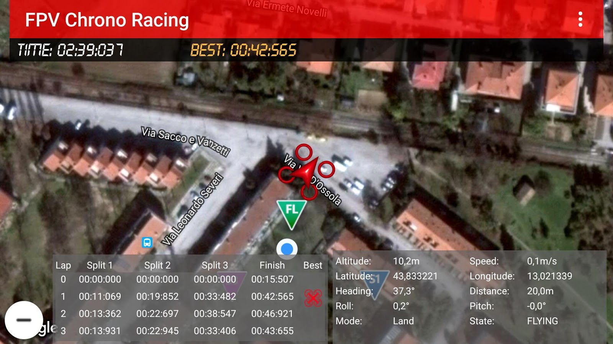

# FPV Chrono Racing
FPV CHRONO RACING turns your Android ™ device in a telemetry system for FPV, allowing you to see the times of your laps and to get the best laps by real time sensing and processing of the telemetry data of your drone, besides, you may compare and share your score table with your friends in order to impress them, and lots more!
FPV CHRONO RACING is based on intelligent algorithms to record the crossing of the finish line. It allows the management of up to three split times through the acquisition of GPS data.
The finish line and split times can be easily positioned via a drag and drop action of their icons on the map!
Requirements: you simply connect a 3D Robotics radio and you install the 3D Robotics Service (it will be automatically installed after the first start).
After the drone connection, the timer will start up as soon as you will take off and tilt your fantastic drone for FPV!
If you have a flight controller like PIXHAWK, PIXRACER or an APM, through their telemetry (MAVLINK) you can connect to FPV CHRONO RACER and immediately you can see the times of your laps!
FPV CHRONO RACING is based on DRONEKIT (DroneKit-Android's) developed by 3D Robotics and ensures maximum efficiency in data acquisition.
So try FPV CHRONO RACING! and help me to increase the features of this fantastic App!

